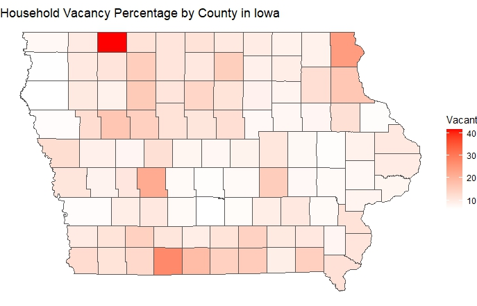

# Create a simple map of a variable of your choice in R using TidyCensus 
In the following map we used 2020 Census Data with R and tidycensus to plot Household Vacancy Percentage by County in Iowa.

