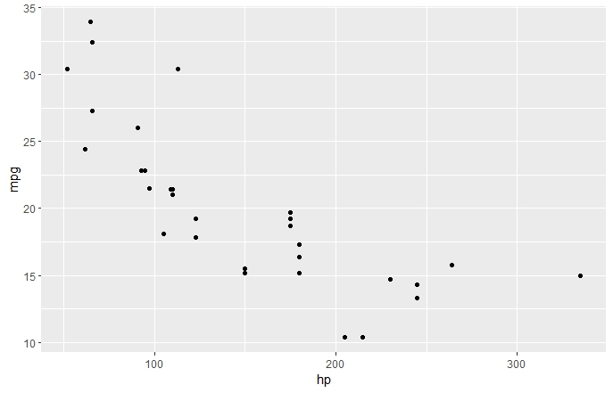
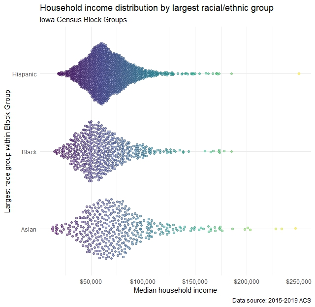

# This is my Exercise 4a file.
Let's create two plots using a built-in dataset in R called mtcars. This dataset contains information on various car models, including their miles per gallon (mpg), horsepower, and other variables. We will create a scatterplot of mpg vs. horsepower, and a barplot of the number of cylinders in each car model.

## Here are the steps to create these plots:
1- Load the ggplot2 package, which we will use to create the plots.
library(ggplot2)

2-Load the mtcars dataset by typing data(mtcars).
data(mtcars)

3-Create a scatterplot of mpg vs. horsepower using ggplot() function. The aes() function is used to specify which variables to plot on the x and y axes.
ggplot(mtcars, aes(x = hp, y = mpg)) + 
  geom_point()
  

4- Create a barplot of the number of cylinders in each car model using ggplot() function. The aes() function is used to specify which variable to use for the x-axis, and the geom_bar() function is used to create the barplot.
ggplot(mtcars, aes(x = factor(cyl))) + 
  geom_bar()
  

  
  
