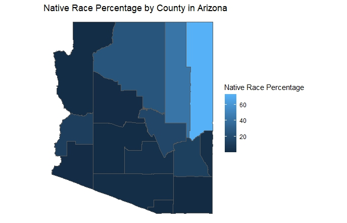

# This is my Assignment 3 file.
## A plot using variable(s) of choice from TidyCensus
For the following map we first calculate the percentage of each race(normalizing data) in counties of Arizona and then plot the Native Race Percentage by County in Arizona.

This bar chart shows the average income by gender of my simple data:

