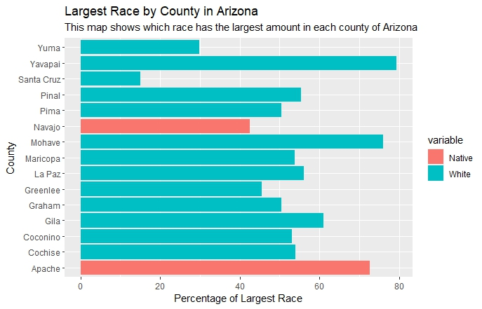
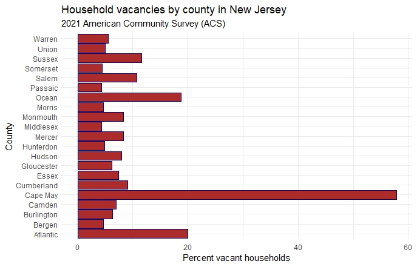
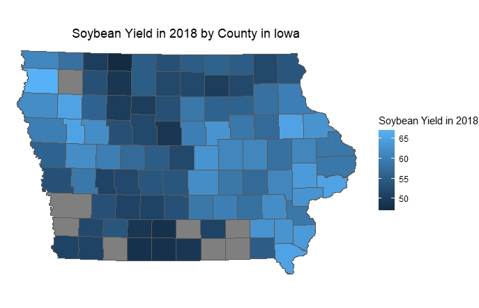

# This is my Assignment 3 file.
## A plot using variable(s) of choice from TidyCensus
For the following map we used American Community Survey (ACS) Data for year of 2021. We first calculated the percentage of each race(normalizing data) in counties of Arizona and then ploted the Native Race Percentage by County in Arizona.

Then we wanted to know what is the largest race in each county of Arizona. The following bar chart shows the largest group(race) by county in Arizona.

## A second plot from tidyCensus or a plot using the world data and  the idbr package 

In the following bar chart we used American Community Survey (ACS) Data to get occupied and vacant households by county in New Jersey. Then we used this data to calculate Household vacancy rates fo all counties in New Jersey. 

## A third plot using external data from a csv, xlsx, google sheet or even a Github repository – note  shp, json, or GeoJSON files are also allowed 

For the following plot we used the soybean yearly yield data for Iowa counties and Iowa counties shape file. We filtered data to show the yield of Iowa Counties only for 2018.

